# MAXSHOP - Next.js 16 Multi-Vendor E-Commerce Storefront

A high-performance, modern multi-vendor e-commerce storefront built with Next.js 16 (React 19, TypeScript, Tailwind CSS v4) and integrated with a Django 5 REST Framework backend and a real-time WebSocket AI shopping assistant.

---

## Key Highlights

- Next.js 16 App Router & Server Components: High-speed Server-Side Rendering (SSR) for catalog pages, SEO optimization, and instant first contentful paint.
- Real-Time AI Shopping Assistant (ShopMate): Connected via bidirectional WebSockets with token streaming, live inventory grounding, and automated UI actions (theme toggling, direct cart additions, checkout navigation).
- Dynamic Banner & Promotion Engine: Multi-image promotional carousel with auto-rotation, pause-on-hover, custom image name badges, and pagination indicators.
- Server-Side Dynamic Site Settings: Hotline phone number, click-to-call link, and top announcement banner rendered dynamically from the database on the server without layout shifts.
- Full Customer Account Portal: Tabbed customer dashboard with account KPIs, profile management, order history, address book management, and security controls.
- Complete Catalog Experience: 24 product categories, dedicated Featured Products and Best Selling Products grids, search bar, active filter badges, and clickable product cards.
- Integrated Dark & Light Modes: Instant theme switching with zero hydration mismatch and persistent local storage synchronization.

---

## Visual Showcase

### 1. Homepage Hero & Promotional Banner Slider
Dynamic homepage layout featuring the category navigation sidebar, database-driven banner slider with auto-rotation, header hotline with click-to-call, and top best-seller widgets.


---

### 2. Dynamic Promotional Banner Carousel (Slide 2)
Multi-image promotional slider demonstrating seamless slide transition, custom display badge ("Smart Wearable & Watch Collection"), and active pagination indicators.

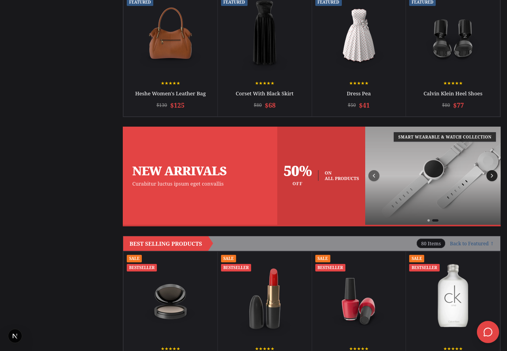

---

### 3. Featured & Best Selling Products Showcase
Collection showcase displaying active featured and best-selling inventory with instant category navigation, discount tags, rating stars, and fully clickable product cards.

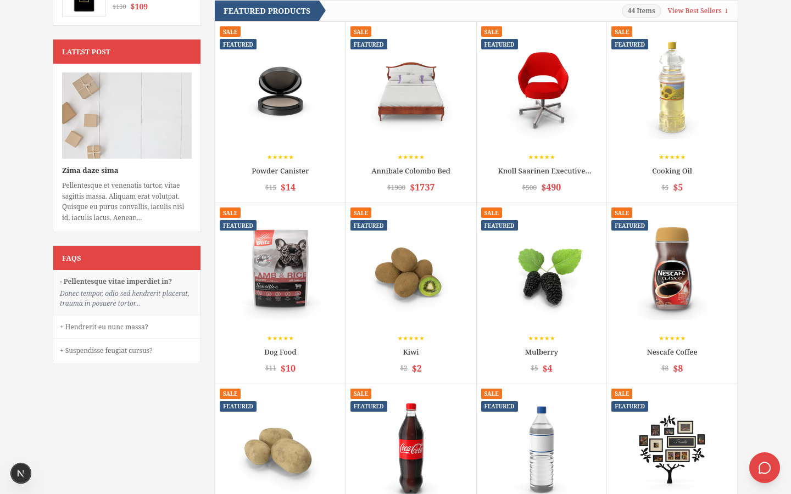

---

### 4. Product Details & Real-Time Pricing
Comprehensive product page with image gallery, real-time discount calculation, stock status indicators, SKU identifiers, quantity selectors, and direct cart operations.

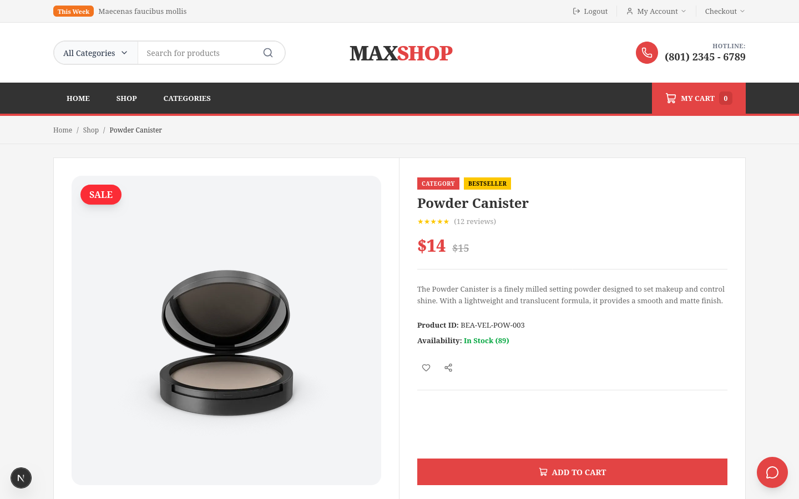

---

### 5. Product Details & Full Specifications View
Detailed view showing customer reviews, ratings summary, category breadcrumb trails, brand metadata, and product tags.

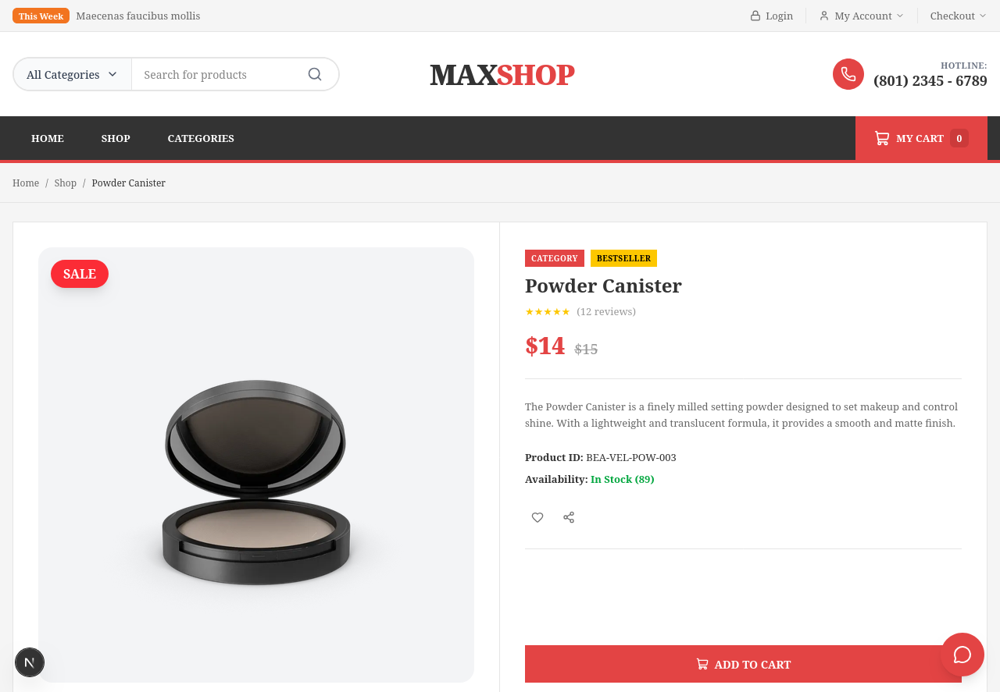

---

### 6. Product Variant & Category Showcase
Product detail display for fashion and cosmetics variants with high-resolution imagery and dynamic pricing badges.

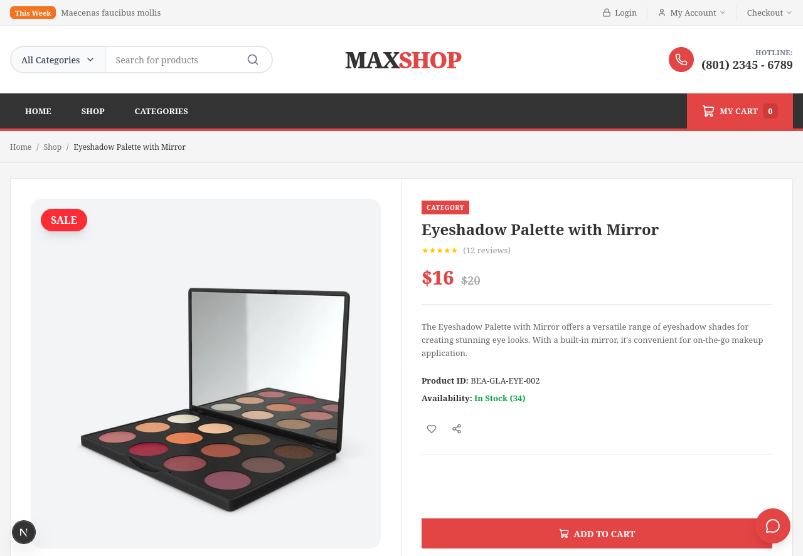

---

### 7. Real-Time AI Shopping Assistant (ShopMate)
Interactive AI shopping assistant connected via WebSockets, answering questions grounded in live product inventory with streaming tokens, discount explanations, and direct action triggers.

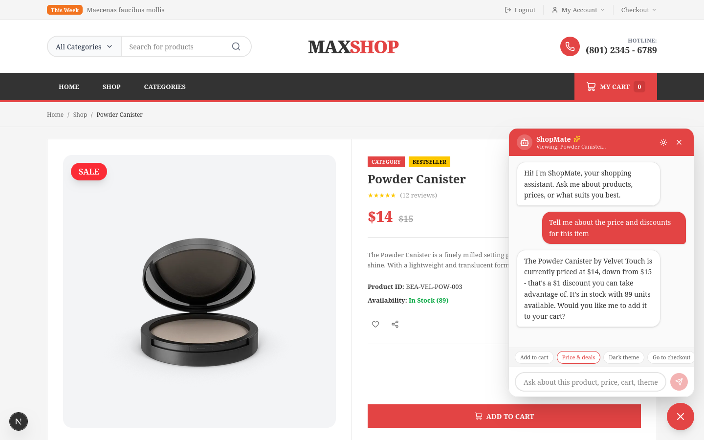

---

### 8. AI Assistant Greeting & Suggestion Chips
Floating AI assistant widget featuring custom avatar branding, store status indicators, and contextual one-click suggestion chips.

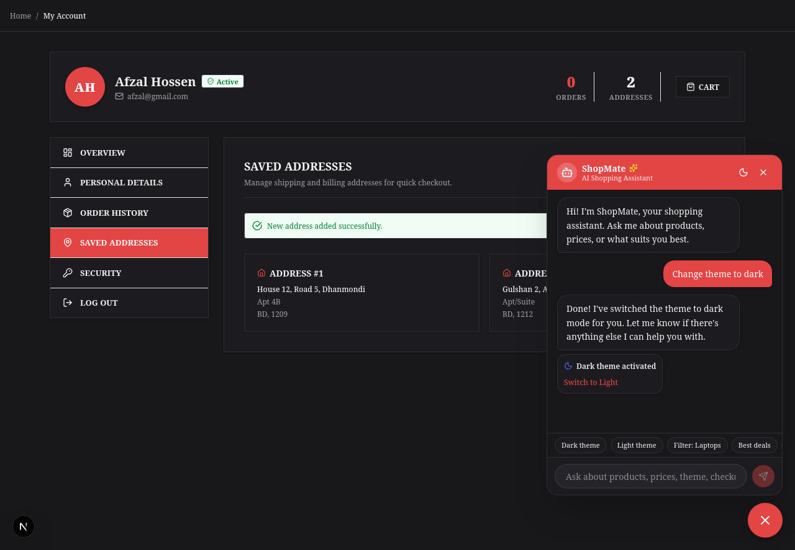

---

### 9. AI Assistant Catalog Grounded Response & Token Streaming
Real-time response streaming with live inventory grounding, quoting exact prices, discount amounts, and stock availability directly from the catalog.

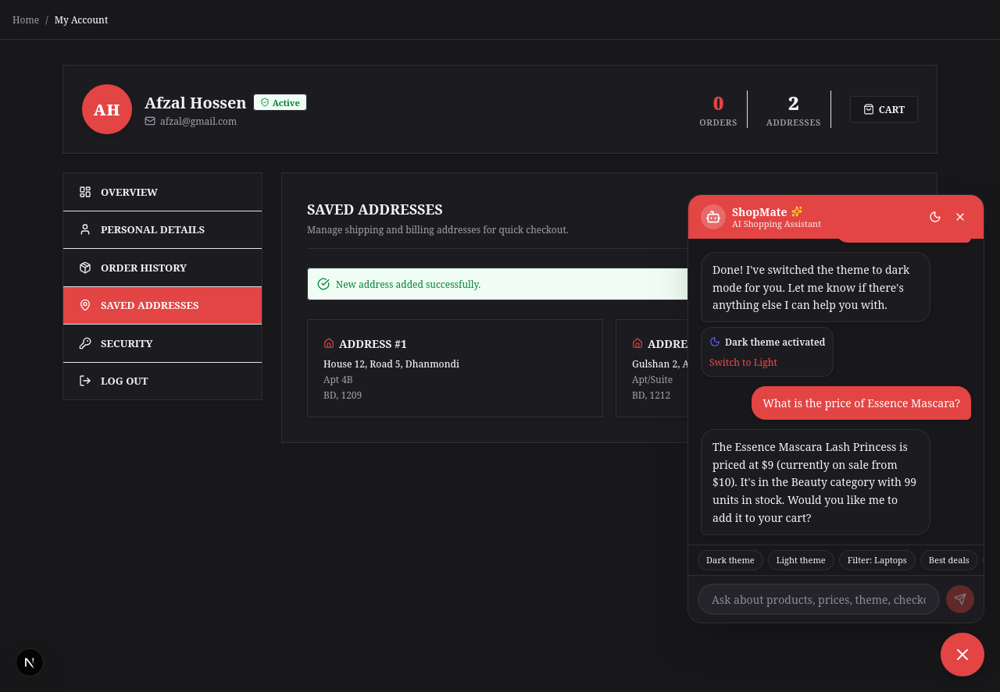

---

### 10. High-Contrast Dark Mode Aesthetic
Full-system dark mode support switchable instantly through user preference or by prompting the AI shopping assistant directly.

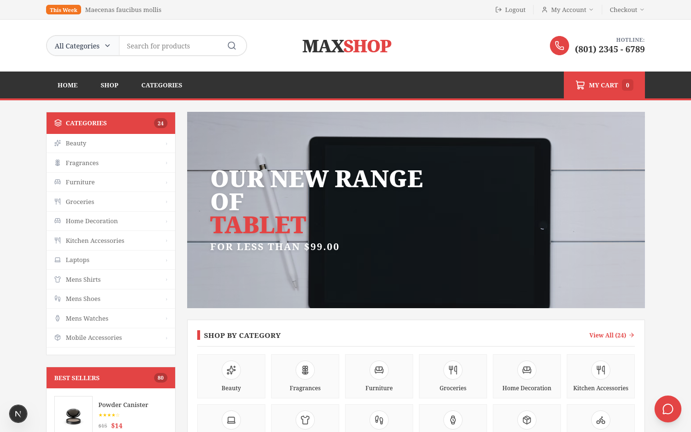

---

### 11. Customer Account Dashboard & KPI Counters
Customer portal featuring profile overview, total order counts, address book summaries, and account verification status.

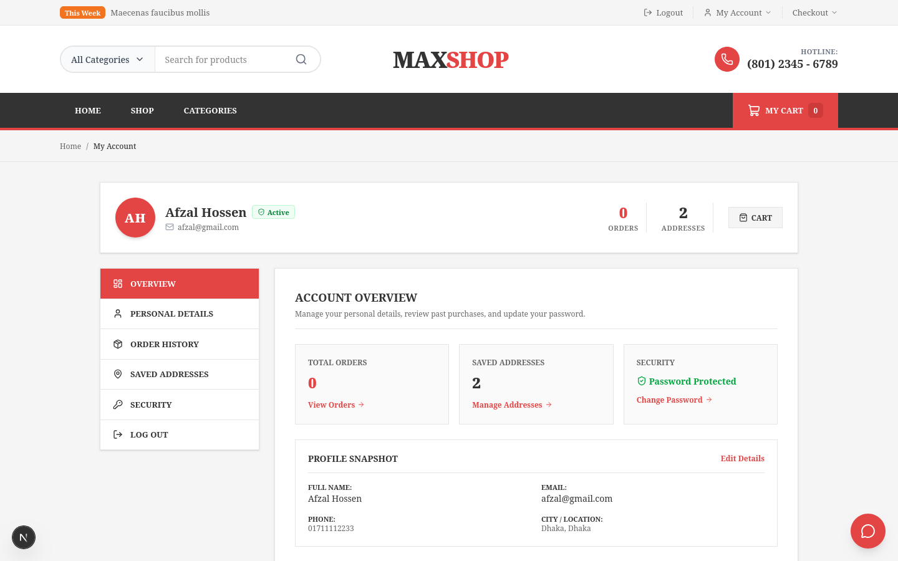

---

### 12. Customer Profile & Order History Overview
Tabbed account management interface displaying personal details, purchase timeline, and account security.

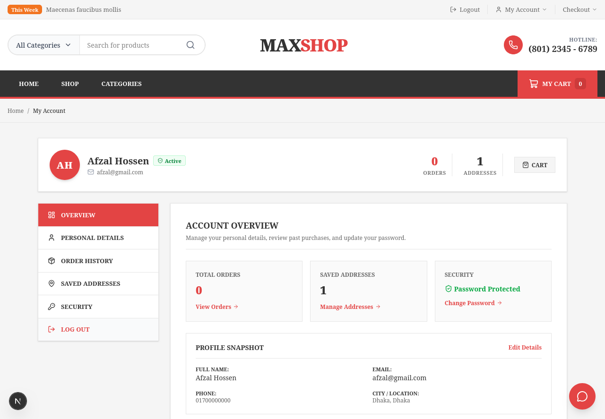

---

### 13. Customer Address Book Management
Address management interface allowing users to view, add, and update shipping and billing addresses with real-time feedback.

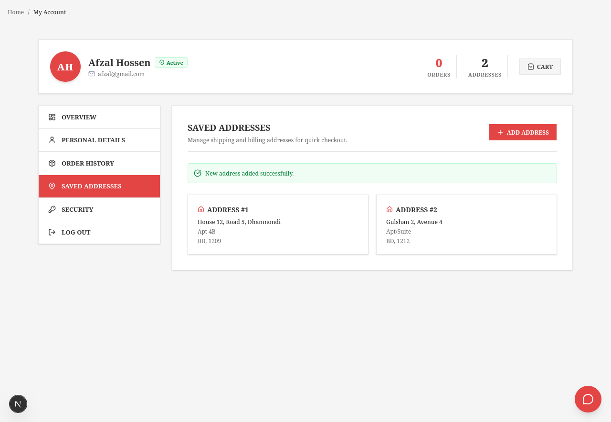

---

### 14. Shopping Cart & Checkout Flow
Streamlined cart management with real-time total calculations, quantity modifications, item removals, and direct checkout routing.

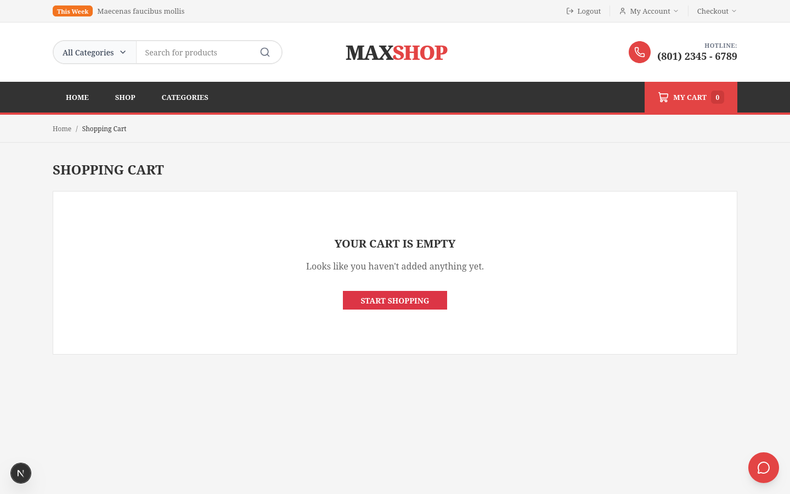

---

### 15. Django Administrative Back-Office
Centralized administration interface for managing vendors, products, inventory, orders, banner sliders, and site-wide configuration.

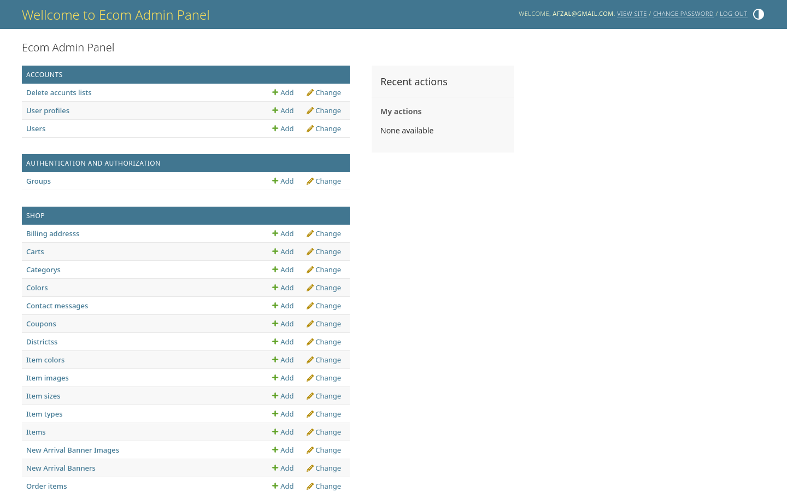

---

## Architecture & Technology Stack

### Core Framework & Libraries
- Framework: Next.js 16.3.4 (App Router)
- React: React 19.2.8
- Language: TypeScript 5.x (Strict Type Checking)
- Styling: Tailwind CSS v4 & PostCSS
- UI Primitives: Base UI, Class Variance Authority (CVA), clsx, tailwind-merge
- Icons: Lucide React
- Payments & Auth: Stripe JS, Google OAuth

### Data Fetching & Communication
- Server-Side Rendering: Server Components fetch catalog data, banners, and site configuration directly via `fetchFromAPI` with `no-store` cache control for fresh data.
- Backend-for-Frontend (BFF) Proxy Layer: Next.js Route Handlers (`src/app/api/*`) securely proxy client requests to Django, managing HttpOnly JWT access and refresh cookies.
- Real-Time WebSockets: Native browser `WebSocket` connection with automatic ticket acquisition (`/api/ai/ws-token`), exponential reconnection handling, and token stream parsing.

---

## Project Structure

```text
storefront/
├── public/                     # Static public assets and icons
├── screenshots/                # Showcase screenshots for documentation (15 images)
├── src/
│   ├── app/
│   │   ├── (auth)/             # Auth group: login, register, reset password, OTP
│   │   ├── about/              # About us page
│   │   ├── account/            # Alias redirect to /profile
│   │   ├── my-account/         # Alias redirect to /profile
│   │   ├── profile/            # Customer Account Dashboard & tabs
│   │   ├── cart/               # Shopping Cart page
│   │   ├── checkout/           # Checkout & order placement
│   │   ├── checkout/success/   # Order confirmation page
│   │   ├── categories/         # Category catalog listing
│   │   ├── products/           # Product catalog with search and filters
│   │   ├── products/[id]/      # Product detail page
│   │   ├── api/                # Next.js Route Handlers (BFF Proxy)
│   │   │   ├── ai/ws-token/    # WebSocket token ticket proxy
│   │   │   ├── auth/           # Login, logout, refresh session endpoints
│   │   │   ├── cart/           # Cart operations proxy
│   │   │   ├── checkout/       # Checkout processing proxy
│   │   │   └── user/           # Profile, addresses, orders, password proxies
│   │   ├── globals.css         # Global styling and dark mode rules
│   │   ├── layout.tsx          # Root layout with site settings & theme hydration
│   │   └── page.tsx            # Main homepage with dynamic banners & collections
│   ├── components/
│   │   ├── ui/                 # Reusable UI primitives (Button, Card, Input, Badge)
│   │   ├── ChatWidget.tsx      # WebSocket AI Shopping Assistant widget
│   │   ├── Navbar.tsx          # Dynamic navigation bar with SSR hotline
│   │   ├── NewArrivalsBanner.tsx # Multi-image promotional carousel
│   │   ├── ProductActionForm.tsx # Product variant selectors and Add to Cart
│   │   ├── ProductGallery.tsx  # Product image gallery with zoom & thumbnails
│   │   ├── ProductInteractions.tsx # Ratings and reviews UI
│   │   └── Providers.tsx       # Context providers & theme initialization
│   └── lib/
│       ├── api.ts              # Server-side API client for Django REST
│       ├── auth.ts             # JWT cookie helper and session management
│       ├── media.ts            # Media URL resolver utility
│       ├── types.ts            # TypeScript interfaces and domain models
│       └── utils.ts            # Class name mergers and styling utilities
├── package.json
├── tsconfig.json
└── next.config.ts
```

---

## Routes & Endpoints

### Storefront Pages
| Route | Type | Description |
| :--- | :--- | :--- |
| `/` | SSR | Homepage with promotional slider, category sidebar, featured & best-seller grids |
| `/products` | SSR | Catalog listing with live search, category, and price range filtering |
| `/products/[id]` | SSR | Detailed product view with gallery, specs, stock status, and contextual AI chat |
| `/categories` | SSR | Complete list of all 24 product categories |
| `/cart` | Client | Interactive shopping cart with live subtotal and quantity controls |
| `/checkout` | Client | Multi-step checkout with saved address selection and payment options |
| `/checkout/success` | SSR | Order success and confirmation summary |
| `/profile` | SSR / Client | Customer account dashboard with order history, addresses, and profile settings |
| `/login` | Client | Customer login with email/password authentication |
| `/register` | Client | New customer account registration |

### Next.js BFF Proxy Routes
| Endpoint | Method | Target Backend Route |
| :--- | :--- | :--- |
| `/api/auth/login` | POST | `/accounts/token/` |
| `/api/auth/logout` | POST | Invalidate HttpOnly session cookies |
| `/api/ai/ws-token` | GET | Authenticated ticket for WebSocket connection |
| `/api/cart` | GET / POST | `/shop/cart/` |
| `/api/user/profile` | GET / PUT | `/accounts/user/profile/` |
| `/api/user/addresses` | GET / POST | `/shop/billing-addresses/` |
| `/api/user/orders` | GET | `/shop/orders/` |
| `/api/user/change-password` | POST | `/accounts/password/change/` |

---

## Real-Time AI Assistant Integration

The storefront features an interactive AI shopping assistant (`ShopMate`) mounted globally via [src/components/ChatWidget.tsx](file:///home/dev-dir/Ecommerce/storefront/src/components/ChatWidget.tsx).

- WebSocket Connection: Automatically negotiates a short-lived ticket via `/api/ai/ws-token` and connects to `ws://127.0.0.1:8000/ws/ai/chat/?token=<ticket>`.
- Contextual Grounding: Injects the active page URL and current product metadata (`id`, `title`, `price`) into outgoing messages so the assistant can answer contextual questions like "Is this product on sale?".
- Stream Parser: Parses incoming chunks character-by-character while stripping control protocol tags.
- Action Tokens:
  - `[[ACTION:THEME:dark]]` / `[[ACTION:THEME:light]]`: Instantly switches store theme.
  - `[[ACTION:ADD_TO_CART:<id>]]`: Calls `/api/cart` to add the item directly to the shopping cart.
  - `[[ACTION:FILTER:<query>]]`: Routes user to filtered catalog results.
  - `[[ACTION:NAVIGATE:<path>]]`: Redirects user to specified destinations (e.g. `/checkout`).

---

## Environment Configuration

Create a `.env.local` file in the `storefront` directory:

```env
# URL to the Django REST Framework backend
NEXT_PUBLIC_API_URL=http://127.0.0.1:8000
```

---

## Getting Started

### 1. Install Dependencies
```bash
npm install
```

### 2. Start the Development Server
```bash
npm run dev
```

The application will be running at [http://localhost:3000](http://localhost:3000).

### 3. Production Build & Linting
```bash
# Type check and build production bundle
npm run build

# Start production server
npm run start

# Run ESLint validation
npm run lint
```

---

## Quality Assurance & Verification

- Type Safety: Fully typed with strict TypeScript (`npx tsc --noEmit` exits with 0 errors).
- Automated End-to-End Testing: Verified via automated browser test suites covering catalog navigation, authentication, profile updates, address creation, and live AI assistant chat.
- Zero Layout Shifts: Server-side data fetching ensures instant, stable rendering for hotlines, categories, and banners.
